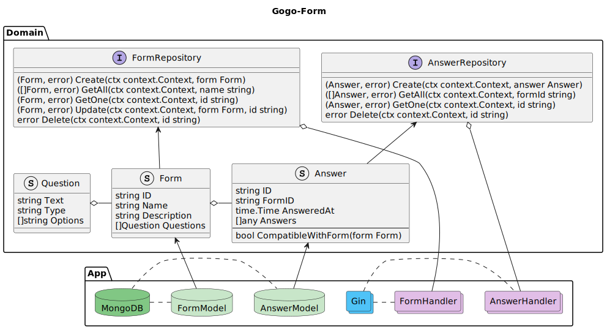

# GoGo Form

This is a simple API project built with Go language that provides functionalities for creating and managing forms and answers.



## Getting Started

### Prerequisites
* Go 1.20
* MongoDB

Or just docker-compose

### Installation (without Docker)

1. Clone the repository:
   ```bash
   git clone https://github.com/Pablo1Gustavo/gogo-form.git
   cd gogo-form
   ```
2. Install the dependencies:
    ```bash
    go mod download
    ```
3. Create a .env file and set your configuration:
    ```bash
    cp .env.example .env
    ```
4. Run the application
    ```bash
    go run main.go
    ```

### Installation (using Docker)

You can easilly run the application with Docker using the following make commands (or running the specified commands on Makefile manually)
* `make build` to build the image
* `make run` to run the application from the container
* `make stop` to stop the container

### Using
After run the application you can test the endpoints looking it in main file or in the postman collection on `doc` folder.